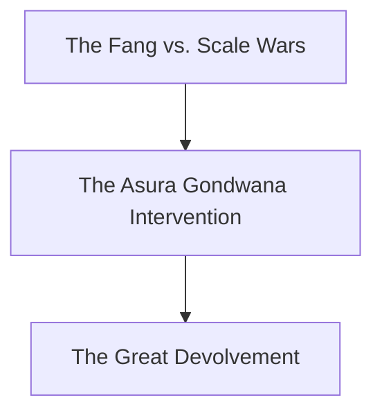
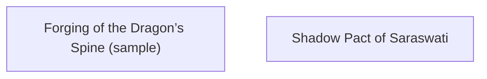
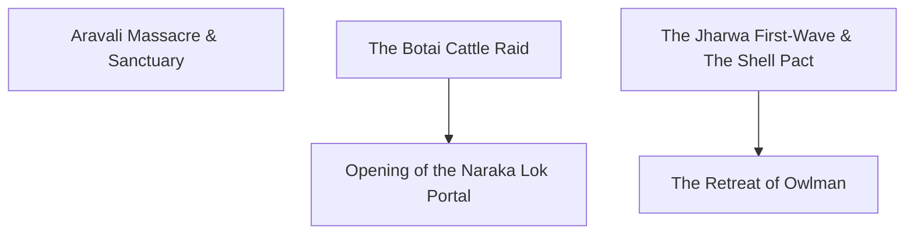
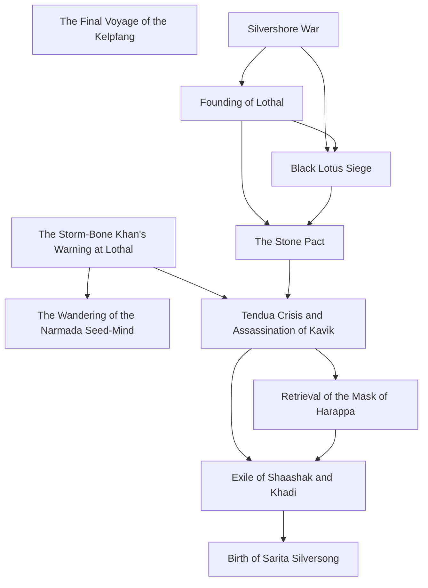
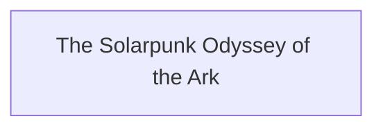

# The Atlas of South of Tethys

[The Timeline](https://lordlebu.github.io/SouthOfTethys/) · [Epochs & Events](https://lordlebu.github.io/SouthOfTethys/timeline_mermaid.html) · **The Atlas**

_Generated from `database/` by `utils/generate_atlas.py`. Do not edit by hand._

Each era below is canon as it stood then. An entity that names no epoch is present in every era — silence means timeless, not unplaced, which is the ruling in `DESIGN.md` and what fauna has always meant.

## Prehistoric Foundations & Age of Vanaras

**500 MYA – 5 MYA**

> Invertebrate Dominion, Avian-Synapsid Epoch, Vanara Zenith and Devolvement

| | dated to this era | timeless |
|---|---:|---:|
| regions |  | 7 |
| places |  | 31 |
| settlements |  | 2 |
| characters | 2 |  |
| factions |  | 3 |
| events | 3 |  |
| artifacts |  | 3 |
| mythology |  | 6 |
| fauna |  | 256 |
| flora |  | 90 |

### Events

### Map

_No map for this era, deliberately._ The only coordinates canon holds belong to the three field maps, and their layout describes the world *after* the Great Shattering. Earlier eras are not drawn because **the Shattering is withheld on purpose** — canon keeps its consequences and not its account, since working it out is what the player is there to do, and the shape of the world before it is part of what is being withheld. Absent by design rather than pending. The timeline, events and census above are everything canon states about this era. See `DESIGN.md`.

## Deep Antiquity

**before the migrations**

> Mythic age of Varunesh and Manjalaya, and the Shadow Pact. Was in use on entities long before it was declared here.

| | dated to this era | timeless |
|---|---:|---:|
| regions |  | 7 |
| places |  | 31 |
| settlements |  | 2 |
| characters | 6 |  |
| factions |  | 3 |
| events | 2 |  |
| artifacts |  | 3 |
| mythology |  | 6 |
| fauna |  | 256 |
| flora |  | 90 |

### Events

### Map

_No map for this era, deliberately._ The only coordinates canon holds belong to the three field maps, and their layout describes the world *after* the Great Shattering. Earlier eras are not drawn because **the Shattering is withheld on purpose** — canon keeps its consequences and not its account, since working it out is what the player is there to do, and the shape of the world before it is part of what is being withheld. Absent by design rather than pending. The timeline, events and census above are everything canon states about this era. See `DESIGN.md`.

## Era of Human Migrations

**50K – 5K years ago**

> Jharwa, Vedda, Naga, Outliers waves

| | dated to this era | timeless |
|---|---:|---:|
| regions |  | 7 |
| places |  | 31 |
| settlements |  | 2 |
| characters | 10 |  |
| factions |  | 3 |
| events | 5 |  |
| artifacts |  | 3 |
| mythology |  | 6 |
| fauna |  | 256 |
| flora |  | 90 |

### Events

### Map

_No map for this era, deliberately._ The only coordinates canon holds belong to the three field maps, and their layout describes the world *after* the Great Shattering. Earlier eras are not drawn because **the Shattering is withheld on purpose** — canon keeps its consequences and not its account, since working it out is what the player is there to do, and the shape of the world before it is part of what is being withheld. Absent by design rather than pending. The timeline, events and census above are everything canon states about this era. See `DESIGN.md`.

## Civilization Dawn (Lothal Era)

**c. 3000 – 500 BCE**

> Harappan city-states, Mask Family, Kia alliance, Tendua Crisis

| | dated to this era | timeless |
|---|---:|---:|
| regions |  | 7 |
| places | 1 | 31 |
| settlements |  | 2 |
| characters | 27 |  |
| factions |  | 3 |
| events | 11 |  |
| artifacts |  | 3 |
| mythology |  | 6 |
| fauna |  | 256 |
| flora |  | 90 |

### Events

### Map

_No map for this era, deliberately._ The only coordinates canon holds belong to the three field maps, and their layout describes the world *after* the Great Shattering. Earlier eras are not drawn because **the Shattering is withheld on purpose** — canon keeps its consequences and not its account, since working it out is what the player is there to do, and the shape of the world before it is part of what is being withheld. Absent by design rather than pending. The timeline, events and census above are everything canon states about this era. See `DESIGN.md`.

## Current Era (Age of Machinery)

**~1920s equivalent**

> Narmada University, dieselpunk exploration

| | dated to this era | timeless |
|---|---:|---:|
| regions |  | 7 |
| places | 1 | 31 |
| settlements |  | 2 |
| characters | 6 |  |
| factions |  | 3 |
| events | 1 |  |
| artifacts |  | 3 |
| mythology |  | 6 |
| fauna |  | 256 |
| flora |  | 90 |

### Events

### Map

_No map for this era, deliberately._ The only coordinates canon holds belong to the three field maps, and their layout describes the world *after* the Great Shattering. Earlier eras are not drawn because **the Shattering is withheld on purpose** — canon keeps its consequences and not its account, since working it out is what the player is there to do, and the shape of the world before it is part of what is being withheld. Absent by design rather than pending. The timeline, events and census above are everything canon states about this era. See `DESIGN.md`.

## Post-Cataclysmic Era (The Great Shattering)

**after the Collapse**

> The Great Shattering. Reckless Narmada excavations in the Age of Machinery met space-time rifts and the pull of sentient Asura planets, and the world fractured under the weight of its own eras -- tectonic and dimensional boundaries collapsing together. Lothal is a half-buried relic with survivors camped in it; Dwarka is drowned and its Gate dormant; Narmada University stands hollow, lit only by Garudasaur moss over ruined scrolls. Varuna and Mitra keep no power worth the name and have turned to preservation: a travelling apothecary and workshop gathering the displaced. The tone is solarpunk, not ruin -- the story ends when the Survival Train stops for good and becomes the centre of a village.

| | dated to this era | timeless |
|---|---:|---:|
| regions |  | 7 |
| places | 1 | 31 |
| settlements |  | 2 |
| field maps | 3 |  |
| points of interest | 20 |  |
| npcs | 8 |  |
| factions |  | 3 |
| events | 1 |  |
| artifacts |  | 3 |
| mythology |  | 6 |
| discoveries | 31 |  |
| field questions | 7 |  |
| vocabulary | 8 |  |
| fauna |  | 256 |
| flora |  | 90 |

### Events

### Map

3 placed. [Open the SVG](atlas/epoch_post_cataclysm.svg)
