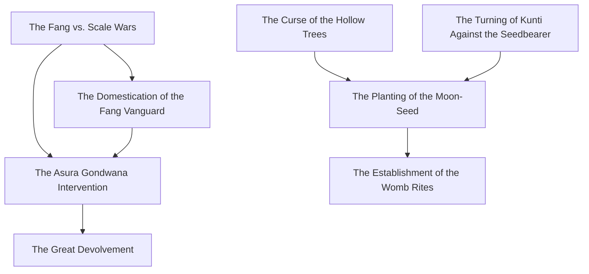
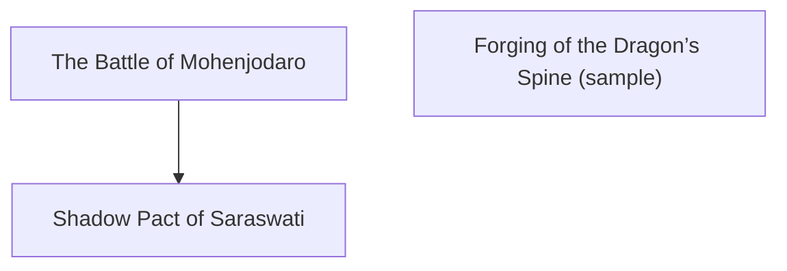
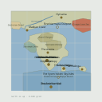
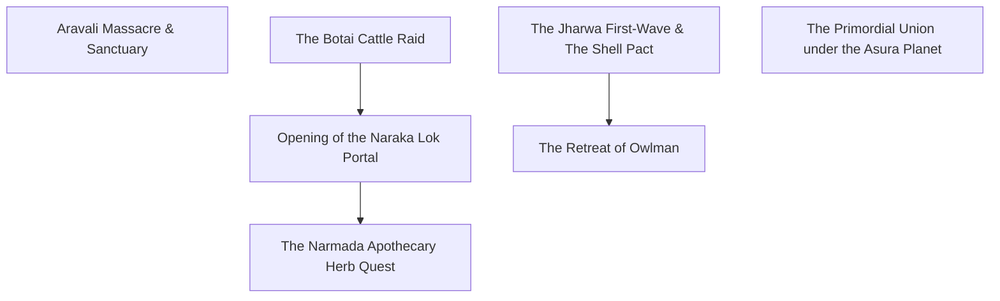
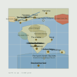
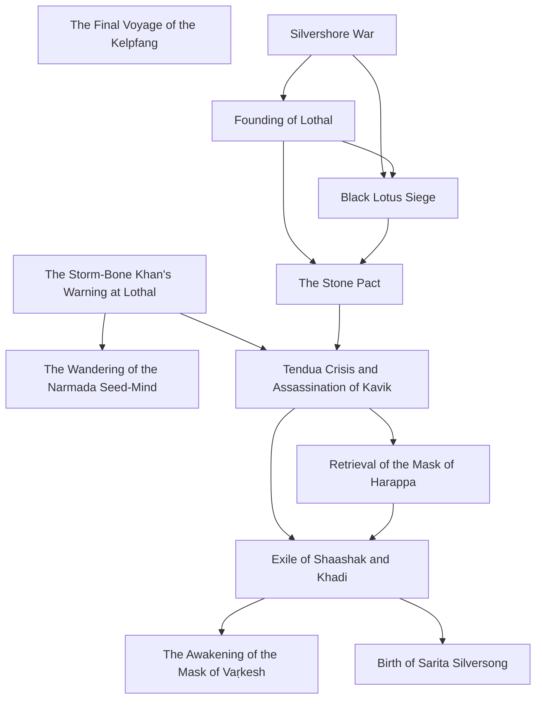
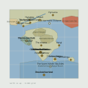
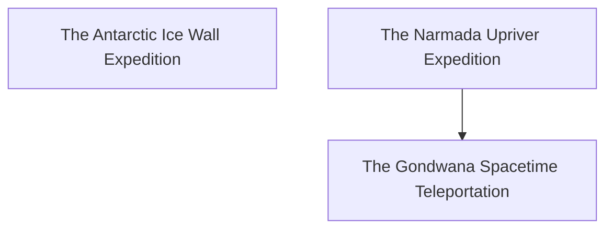
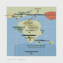

# The Atlas of South of Tethys

<a href="https://lordlebu.github.io/SouthOfTethys/">The Timeline</a> &middot; <a href="https://lordlebu.github.io/SouthOfTethys/timeline_mermaid.html">Epochs &amp; Events</a> &middot; <strong>The Atlas</strong> &middot; <a href="https://lordlebu.github.io/SouthOfTethys/memory_map.html">The Memory Map</a>

_Generated from `database/` by `utils/generate_atlas.py`. Do not edit by hand._

Each era below is canon as it stood then. An entity that names no epoch is present in every era — silence means timeless, not unplaced, which is the ruling in `DESIGN.md` and what fauna has always meant.

## Prehistoric Foundations & Age of Vanaras

**500 MYA – 5 MYA**

> Invertebrate Dominion, Avian-Synapsid Epoch, Vanara Zenith and Devolvement

| | dated to this era | timeless |
|---|---:|---:|
| regions |  | 7 |
| places | 11 | 20 |
| settlements |  | 2 |
| characters | 5 |  |
| factions |  | 3 |
| events | 8 |  |
| artifacts |  | 4 |
| mythology |  | 8 |
| fauna |  | 257 |
| flora |  | 90 |

### Events

### Map

*No map is drawn for this era.* The grid canon uses is traced off `dump/Partial_map.png`, which shows a living Harappa and a standing university -- it is a picture of the Civilization Dawn world. This era predates every landmark that map is built from, so placing anything on it would claim a geography canon does not have. What the era holds is in the census above.

## Deep Antiquity

**before the migrations**

> Mythic age of Varunesh and Manjalaya, and the Shadow Pact. Was in use on entities long before it was declared here.

| | dated to this era | timeless |
|---|---:|---:|
| regions |  | 7 |
| places | 11 | 20 |
| settlements |  | 2 |
| characters | 7 |  |
| factions |  | 3 |
| events | 3 |  |
| artifacts |  | 4 |
| mythology |  | 8 |
| fauna |  | 257 |
| flora |  | 90 |

### Events

### Map

6 region(s) traced, 8 place(s) plotted. [Open the SVG](atlas/epoch_deep_antiquity.svg)

## Era of Human Migrations

**50K – 5K years ago**

> Jharwa, Vedda, Naga, Outliers waves

| | dated to this era | timeless |
|---|---:|---:|
| regions |  | 7 |
| places | 16 | 20 |
| settlements |  | 2 |
| characters | 11 |  |
| factions |  | 3 |
| events | 7 |  |
| artifacts |  | 4 |
| mythology |  | 8 |
| fauna |  | 257 |
| flora |  | 90 |

### Events

### Map

6 region(s) traced, 13 place(s) plotted. [Open the SVG](atlas/epoch_migrations.svg)

## Civilization Dawn (Lothal Era)

**c. 3000 – 500 BCE**

> Harappan city-states, Mask Family, Kia alliance, Tendua Crisis

| | dated to this era | timeless |
|---|---:|---:|
| regions |  | 7 |
| places | 17 | 20 |
| settlements |  | 2 |
| characters | 27 |  |
| factions |  | 3 |
| events | 12 |  |
| artifacts |  | 4 |
| mythology |  | 8 |
| fauna |  | 257 |
| flora |  | 90 |

### Events

### Map

6 region(s) traced, 13 place(s) plotted. [Open the SVG](atlas/epoch_civilization_dawn.svg)

## Current Era (Age of Machinery)

**~1920s equivalent**

> Narmada University, dieselpunk exploration

| | dated to this era | timeless |
|---|---:|---:|
| regions |  | 7 |
| places | 17 | 20 |
| settlements |  | 2 |
| characters | 6 |  |
| factions |  | 3 |
| events | 3 |  |
| artifacts |  | 4 |
| mythology |  | 8 |
| fauna |  | 257 |
| flora |  | 90 |

### Events

### Map

6 region(s) traced, 13 place(s) plotted. [Open the SVG](atlas/epoch_current.svg)

## Post-Cataclysmic Era (The Great Shattering)

**after the Collapse**

> The Great Shattering. Reckless Narmada excavations in the Age of Machinery met space-time rifts and the pull of sentient Asura planets, and the world fractured under the weight of its own eras -- tectonic and dimensional boundaries collapsing together. Lothal is a half-buried relic with survivors camped in it; Dwarka is drowned and its Gate dormant; Narmada University stands hollow, lit only by Garudasaur moss over ruined scrolls. Varuna and Mitra keep no power worth the name and have turned to preservation: a travelling apothecary and workshop gathering the displaced. The tone is solarpunk, not ruin -- the story ends when the Survival Train stops for good and becomes the centre of a village.

| | dated to this era | timeless |
|---|---:|---:|
| regions |  | 7 |
| places | 12 | 20 |
| settlements |  | 2 |
| field maps | 3 |  |
| points of interest | 20 |  |
| characters | 1 |  |
| npcs | 8 |  |
| factions |  | 3 |
| events | 1 |  |
| artifacts |  | 4 |
| mythology |  | 8 |
| discoveries | 31 |  |
| field questions | 7 |  |
| vocabulary | 8 |  |
| fauna |  | 257 |
| flora |  | 90 |

### Events

### Map

0 region(s) traced, 11 place(s) plotted. [Open the SVG](atlas/epoch_post_cataclysm.svg)
