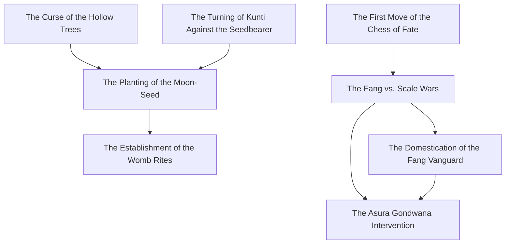
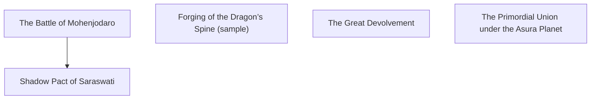
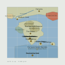
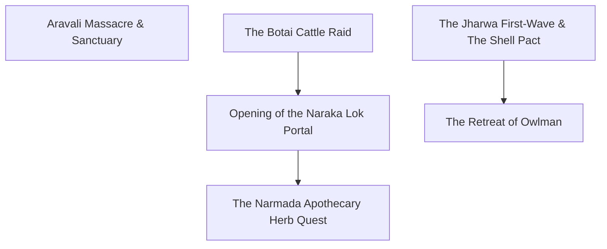
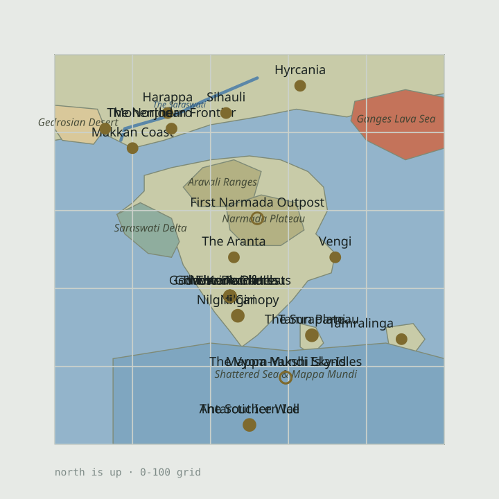
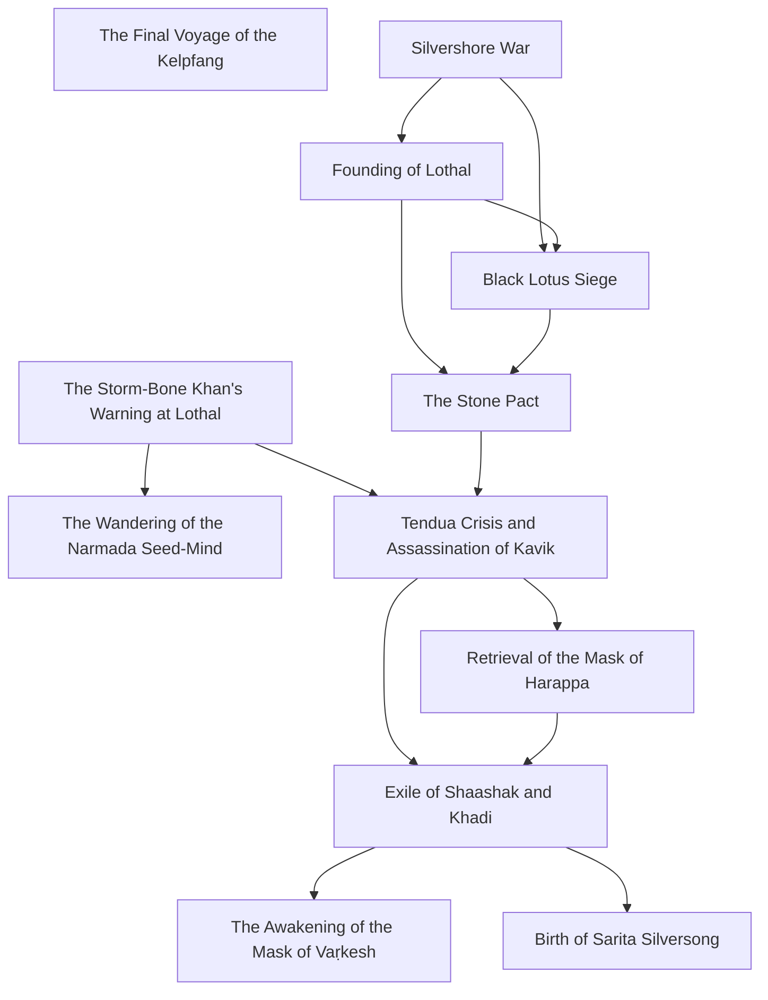
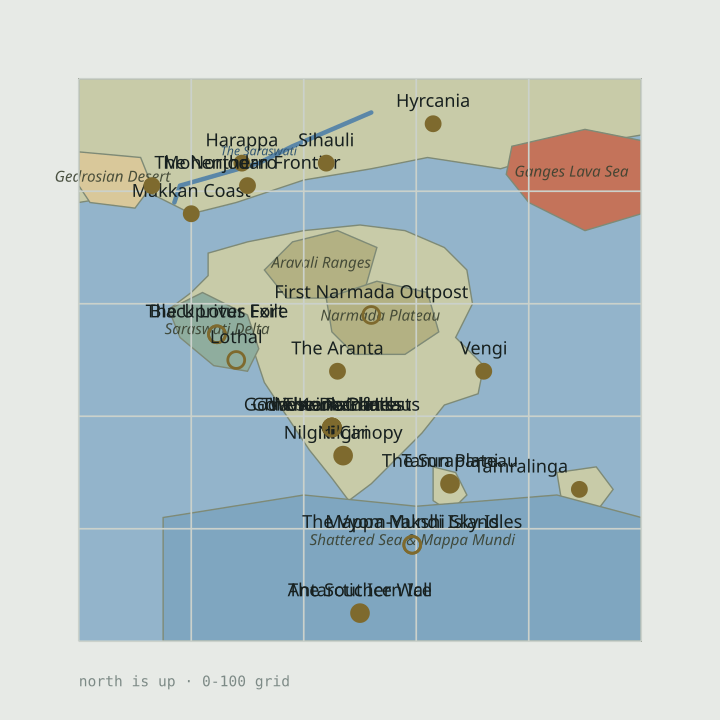
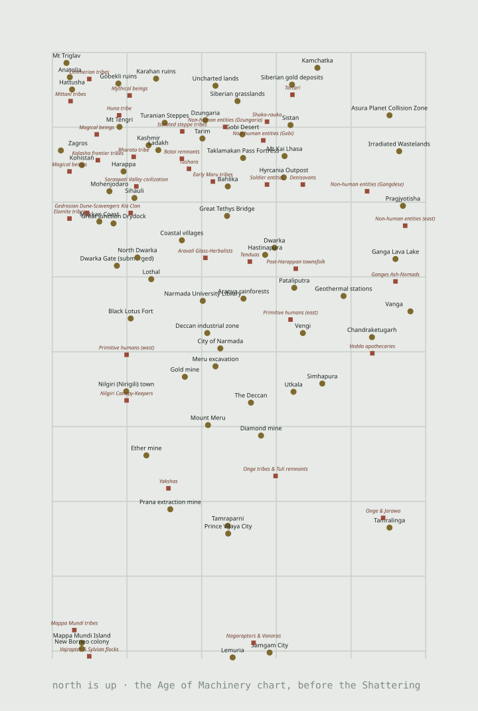
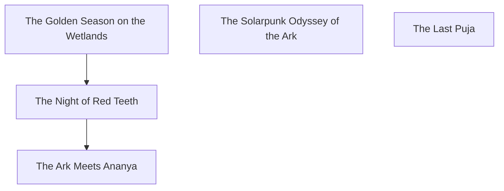
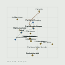

# The Atlas of South of Tethys

<a href="https://lordlebu.github.io/SouthOfTethys/">The Timeline</a> &middot; <a href="https://lordlebu.github.io/SouthOfTethys/timeline_mermaid.html">Epochs &amp; Events</a> &middot; <strong>The Atlas</strong> &middot; <a href="https://lordlebu.github.io/SouthOfTethys/memory_map.html">The Memory Map</a> &middot; <a href="https://lordlebu.github.io/SouthOfTethys/bestiary.html">The Bestiary</a> &middot; <a href="https://lordlebu.github.io/SouthOfTethys/cookbook.html">The Cookbook</a>

_Generated from `database/` by `utils/generate_atlas.py`. Do not edit by hand._

Each era below is canon as it stood then. An entity that names no epoch is present in every era — silence means timeless, not unplaced, which is the ruling in `DESIGN.md` and what fauna has always meant.

## Prehistoric Foundations & Age of Vanaras

**500 MYA – 5 MYA**

> Invertebrate Dominion, Avian-Synapsid Epoch, Vanara Zenith and Devolvement

| | dated to this era | timeless |
|---|---:|---:|
| regions |  | 7 |
| places | 20 | 26 |
| settlements |  | 1 |
| characters | 9 |  |
| factions |  | 6 |
| events | 8 |  |
| artifacts |  | 6 |
| mythology |  | 11 |
| fauna |  | 267 |
| flora |  | 120 |
| foodways |  | 19 |

### Events

```mermaid
graph TD
    E0["The Curse of the Hollow Trees"]
    E1["The Turning of Kunti Against the Seedbearer"]
    E2["The Planting of the Moon-Seed"]
    E3["The Establishment of the Womb Rites"]
    E4["The First Move of the Chess of Fate"]
    E5["The Fang vs. Scale Wars"]
    E6["The Domestication of the Fang Vanguard"]
    E7["The Asura Gondwana Intervention"]
    E0 --> E2
    E1 --> E2
    E2 --> E3
    E4 --> E5
    E5 --> E7
    E5 --> E6
    E6 --> E7
```

### Map

*No map is drawn for this era.* The grid canon uses is traced off `dump/Partial_map.png`, which shows a living Harappa and a standing university -- it is a picture of the Civilization Dawn world. This era predates every landmark that map is built from, so placing anything on it would claim a geography canon does not have. What the era holds is in the census above.

## Deep Antiquity

**before the migrations**

> Mythic age of Varunesh and Manjalaya, and the Shadow Pact. Was in use on entities long before it was declared here.

| | dated to this era | timeless |
|---|---:|---:|
| regions |  | 7 |
| places | 21 | 26 |
| settlements |  | 1 |
| characters | 7 |  |
| factions |  | 6 |
| events | 5 |  |
| artifacts |  | 6 |
| mythology |  | 11 |
| fauna |  | 267 |
| flora |  | 120 |
| foodways |  | 19 |

### Events

```mermaid
graph TD
    E0["The Battle of Mohenjodaro"]
    E1["Forging of the Dragon’s Spine (sample)"]
    E2["The Great Devolvement"]
    E3["Shadow Pact of Saraswati"]
    E4["The Primordial Union under the Asura Planet"]
    E0 --> E3
```

### Map

6 region(s) traced, 18 place(s) plotted. [Open the SVG](atlas/epoch_deep_antiquity.svg)

## Era of Human Migrations

**50K – 5K years ago**

> Jharwa, Vedda, Naga, Outliers waves

| | dated to this era | timeless |
|---|---:|---:|
| regions |  | 7 |
| places | 26 | 26 |
| settlements |  | 1 |
| points of interest | 1 |  |
| characters | 12 |  |
| factions |  | 6 |
| events | 6 |  |
| artifacts |  | 6 |
| mythology |  | 11 |
| fauna |  | 267 |
| flora |  | 120 |
| foodways |  | 19 |

### Events

```mermaid
graph TD
    E0["Aravali Massacre & Sanctuary"]
    E1["The Botai Cattle Raid"]
    E2["The Jharwa First-Wave & The Shell Pact"]
    E3["Opening of the Naraka Lok Portal"]
    E4["The Narmada Apothecary Herb Quest"]
    E5["The Retreat of Owlman"]
    E1 --> E3
    E2 --> E5
    E3 --> E4
```

### Map

6 region(s) traced, 23 place(s) plotted. [Open the SVG](atlas/epoch_migrations.svg)

## Civilization Dawn (Lothal Era)

**c. 3000 – 500 BCE**

> Harappan city-states, Mask Family, Kia alliance, Tendua Crisis

| | dated to this era | timeless |
|---|---:|---:|
| regions |  | 7 |
| places | 29 | 26 |
| settlements | 1 | 1 |
| points of interest | 1 |  |
| characters | 27 |  |
| factions |  | 6 |
| events | 12 |  |
| artifacts |  | 6 |
| mythology |  | 11 |
| fauna |  | 267 |
| flora |  | 120 |
| foodways |  | 19 |

### Events

```mermaid
graph TD
    E0["The Final Voyage of the Kelpfang"]
    E1["The Storm-Bone Khan's Warning at Lothal"]
    E2["The Wandering of the Narmada Seed-Mind"]
    E3["Silvershore War"]
    E4["Founding of Lothal"]
    E5["Black Lotus Siege"]
    E6["The Stone Pact"]
    E7["Tendua Crisis and Assassination of Kavik"]
    E8["Retrieval of the Mask of Harappa"]
    E9["Exile of Shaashak and Khadi"]
    E10["The Awakening of the Mask of Vaṛkesh"]
    E11["Birth of Sarita Silversong"]
    E1 --> E7
    E1 --> E2
    E3 --> E5
    E3 --> E4
    E4 --> E6
    E4 --> E5
    E5 --> E6
    E6 --> E7
    E7 --> E8
    E7 --> E9
    E8 --> E9
    E9 --> E10
    E9 --> E11
```

### Map

6 region(s) traced, 26 place(s) plotted. [Open the SVG](atlas/epoch_civilization_dawn.svg)

## The Age of Machinery

**~1920s equivalent**

> Narmada University, dieselpunk exploration

**Renamed from "Current Era (Age of Machinery)".** It was never the current era from any reader's position and it is emphatically not the player's: the game is set in `epoch_post_cataclysm`, after this one ended, walking through what it left behind. A label that means "now" on the era a player finds in ruins is the kind of name that quietly misleads every future author.

The id stays `epoch_current` deliberately. Fifty-five entities reference it and the atlas writes `docs/atlas/epoch_current.svg`; renaming an id to fix a display name is how a rename becomes a migration. The name is what anybody reads.

| | dated to this era | timeless |
|---|---:|---:|
| regions |  | 7 |
| places | 82 | 26 |
| settlements | 1 | 1 |
| points of interest | 1 |  |
| characters | 10 |  |
| factions | 9 | 6 |
| events | 19 |  |
| artifacts |  | 6 |
| mythology |  | 11 |
| fauna |  | 267 |
| flora |  | 120 |
| foodways | 1 | 19 |

### Events

```mermaid
graph TD
    E0["The Antarctic Ice Wall Expedition"]
    E1["The Cartographic & Mercantile Accord"]
    E2["The Delta Outrigger Skirmishes"]
    E3["Drilling Halted at the Dwarka Gate"]
    E4["The Frontier Marrow Wars"]
    E5["The Great Coal & Dolmen War"]
    E6["The Great Marrow & Coal War"]
    E7["The Day the Ground Broke at the Great Junction"]
    E8["The Mappa Mundi Colonial Insurgencies"]
    E9["The Mappa Mundi Telegraph Sabotage"]
    E10["The Moriah Spore-Blight"]
    E11["The Narmada Upriver Expedition"]
    E12["The Gondwana Spacetime Teleportation"]
    E13["The Battered Ekranoplan's Ice Wall Voyage"]
    E14["The Paratethyan Lock Blockades"]
    E15["Polar Voyagers Arrive at Tamralinga"]
    E16["The Saraswati Canal Drains"]
    E17["Tide-Lock Three Opens"]
    E18["The Undersea Lava River and the Red Fog"]
    E5 --> E6
    E11 --> E12
    E12 --> E13
```

### Map

Drawn from the era's own chart: 66 place(s) and 38 people(s), before the Shattering. [Open the SVG](atlas/epoch_current.svg)

## Post-Cataclysmic Era (The Great Shattering)

**after the Collapse**

> The Great Shattering. Reckless Narmada excavations in the Age of Machinery met space-time rifts and the pull of sentient Asura planets, and the world fractured under the weight of its own eras -- tectonic and dimensional boundaries collapsing together. Lothal is a half-buried relic with survivors camped in it; Dwarka is drowned and its Gate dormant; Narmada University stands hollow, lit only by Garudasaur moss over ruined scrolls. Varuna and Mitra keep no power worth the name and have turned to preservation: a travelling apothecary and workshop gathering the displaced. The tone is solarpunk, not ruin -- the story ends when the Survival Train stops for good and becomes the centre of a village.

| | dated to this era | timeless |
|---|---:|---:|
| regions |  | 7 |
| places | 28 | 26 |
| settlements | 1 | 1 |
| field maps | 4 |  |
| points of interest | 37 |  |
| characters | 4 |  |
| npcs | 26 |  |
| happenings | 16 |  |
| factions | 3 | 6 |
| events | 5 |  |
| artifacts |  | 6 |
| mythology |  | 11 |
| discoveries | 46 |  |
| field questions | 8 |  |
| vocabulary | 10 |  |
| fauna |  | 267 |
| flora |  | 120 |
| foodways | 1 | 19 |
| sayings | 33 |  |
| storylines | 2 |  |

### Events

```mermaid
graph TD
    E0["The Golden Season on the Wetlands"]
    E1["The Night of Red Teeth"]
    E2["The Ark Meets Ananya"]
    E3["The Solarpunk Odyssey of the Ark"]
    E4["The Last Puja"]
    E0 --> E1
    E1 --> E2
```

### Map

0 region(s) traced, 26 place(s) plotted. [Open the SVG](atlas/epoch_post_cataclysm.svg)
