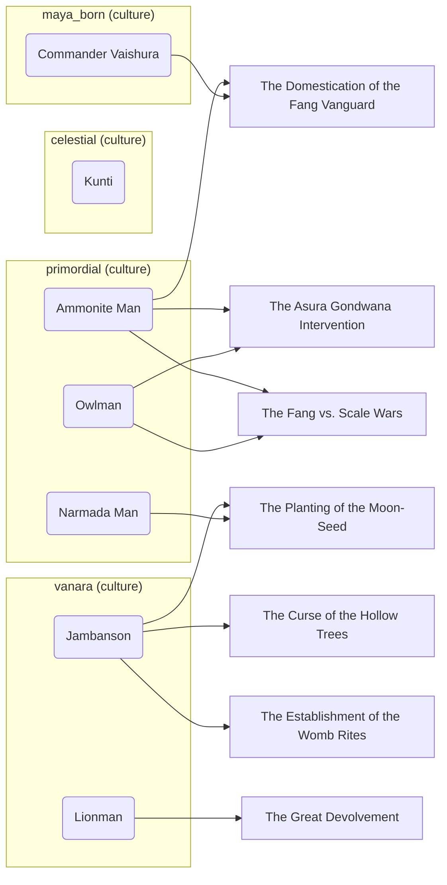
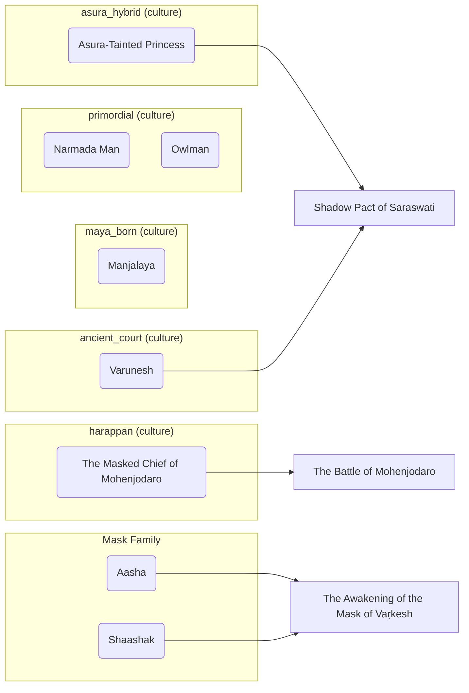
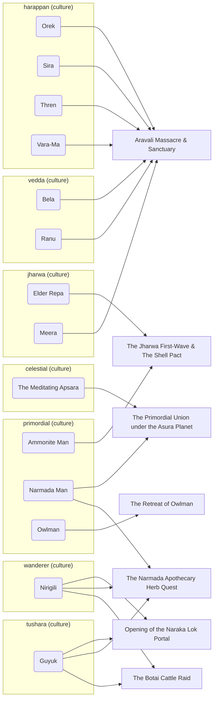
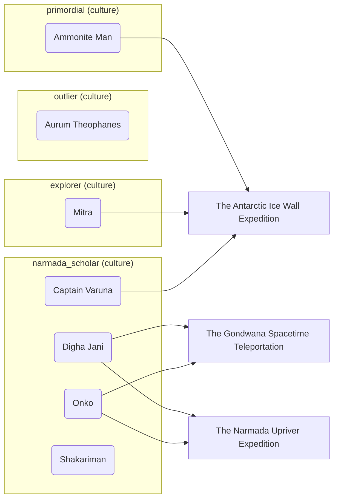
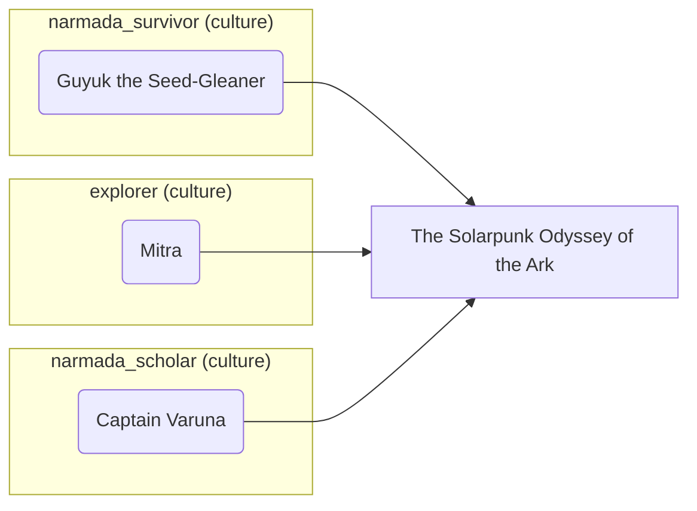

# The Memory Map

<a href="https://lordlebu.github.io/SouthOfTethys/">The Timeline</a> &middot; <a href="https://lordlebu.github.io/SouthOfTethys/timeline_mermaid.html">Epochs &amp; Events</a> &middot; <a href="https://lordlebu.github.io/SouthOfTethys/atlas.html">The Atlas</a> &middot; <strong>The Memory Map</strong>

*Generated by `utils/generate_memory_map.py`. Do not edit by hand.*

Who canon remembers, one era at a time: the people, the events they were present at,
and the factions and cultures that hold them. The timeline says when and the atlas says
where; this says who.

Grouping is by faction where someone has one and by culture otherwise, because a person
has both and the boxes cannot overlap. A character who appears in no event yet still
draws, unconnected, rather than being left out.

## Prehistoric Foundations & Age of Vanaras

7 character(s), 7 event(s) they appear in, 4 group(s).

**Present in no event of this era:** Kunti.

## Deep Antiquity

8 character(s), 3 event(s) they appear in, 6 group(s).

**Present in no event of this era:** Manjalaya, Narmada Man, Owlman.

## Era of Human Migrations

14 character(s), 7 event(s) they appear in, 7 group(s).

## Civilization Dawn (Lothal Era)

```mermaid
graph LR
  subgraph grp_cosmic["cosmic (culture)"]
    character_radiant_gentleman("The Radiant Gentleman")
  end
  subgraph grp_harappan_kia["harappan_kia (culture)"]
    character_sarita("Sarita")
  end
  subgraph grp_lundish["lundish (culture)"]
    character_elara_voss("Elara Voss")
  end
  subgraph grp_maya_born["maya_born (culture)"]
    character_daedrasura("Daedrasura")
  end
  subgraph grp_polynesian_khmer["polynesian_khmer (culture)"]
    character_naga_raja("Naga-Raja")
  end
  subgraph grp_primordial["primordial (culture)"]
    character_narmada_man("Narmada Man")
  end
  subgraph grp_tamralinga["tamralinga (culture)"]
    character_vijaya("Vijaya")
  end
  subgraph grp_trader["trader (culture)"]
    character_rathak("Rathak")
  end
  subgraph grp_tuli["tuli (culture)"]
    character_korran_driftwood_seer("Korran Driftwood Seer")
    character_lirael_wavecaller("Lirael Wavecaller")
    character_sirael_thorncurrent("Sirael Thorncurrent")
  end
  subgraph grp_tushara["tushara (culture)"]
    character_guyuk("Guyuk")
  end
  subgraph grp_unknown["unknown (culture)"]
    character_the_traveler("The Traveler")
  end
  subgraph grp_wanderer["wanderer (culture)"]
    character_ruvan("Ruvan")
  end
  subgraph grp_yaksha["yaksha (culture)"]
    character_kubera("Kubera")
    character_yaksha_envoy("Yaksha Envoy")
  end
  subgraph grp_kia_clan["Kia Clan"]
    character_arin("Arin")
    character_khadi("Khadi")
    character_mira("Mira")
    character_nila("Nila")
  end
  subgraph grp_mask_family["Mask Family"]
    character_asha("Aasha")
    character_kavik("Kavik")
    character_mehme("Mehme")
    character_shaashak("Shaashak")
    character_iknaya("iKnaya")
  end
  subgraph grp_silvershore_dynasty["Silvershore Dynasty"]
    character_jarek("Jarek")
    character_lira("Lira")
    character_torin("Torin")
    character_varna("Varna")
  end
  event_birth_of_sarita["Birth of Sarita Silversong"]
  event_black_lotus_siege["Black Lotus Siege"]
  event_exile_of_shaashak["Exile of Shaashak and Khadi"]
  event_final_voyage_of_the_kelpfang["The Final Voyage of the Kelpfang"]
  event_founding_lothal["Founding of Lothal"]
  event_guyuk_konkan_prophecy["The Wandering of the Narmada Seed-Mind"]
  event_guyuk_lothal_warning["The Storm-Bone Khan's Warning at Lothal"]
  event_mask_retrieval["Retrieval of the Mask of Harappa"]
  event_silvershore_war["Silvershore War"]
  event_stone_pact["The Stone Pact"]
  event_tendua_crisis["Tendua Crisis and Assassination of Kavik"]
  character_asha --> event_mask_retrieval
  character_asha --> event_tendua_crisis
  character_elara_voss --> event_final_voyage_of_the_kelpfang
  character_guyuk --> event_guyuk_konkan_prophecy
  character_guyuk --> event_guyuk_lothal_warning
  character_iknaya --> event_mask_retrieval
  character_jarek --> event_silvershore_war
  character_kavik --> event_black_lotus_siege
  character_kavik --> event_founding_lothal
  character_kavik --> event_silvershore_war
  character_kavik --> event_stone_pact
  character_kavik --> event_tendua_crisis
  character_khadi --> event_birth_of_sarita
  character_khadi --> event_exile_of_shaashak
  character_khadi --> event_stone_pact
  character_khadi --> event_tendua_crisis
  character_korran_driftwood_seer --> event_final_voyage_of_the_kelpfang
  character_lirael_wavecaller --> event_final_voyage_of_the_kelpfang
  character_mehme --> event_guyuk_lothal_warning
  character_mehme --> event_tendua_crisis
  character_naga_raja --> event_black_lotus_siege
  character_narmada_man --> event_guyuk_konkan_prophecy
  character_nila --> event_tendua_crisis
  character_radiant_gentleman --> event_final_voyage_of_the_kelpfang
  character_rathak --> event_black_lotus_siege
  character_sarita --> event_birth_of_sarita
  character_shaashak --> event_birth_of_sarita
  character_shaashak --> event_exile_of_shaashak
  character_shaashak --> event_guyuk_lothal_warning
  character_shaashak --> event_stone_pact
  character_shaashak --> event_tendua_crisis
  character_sirael_thorncurrent --> event_final_voyage_of_the_kelpfang
  character_the_traveler --> event_final_voyage_of_the_kelpfang
  character_torin --> event_silvershore_war
  character_varna --> event_black_lotus_siege
  character_varna --> event_mask_retrieval
```

29 character(s), 11 event(s) they appear in, 16 group(s).

**Present in no event of this era:** Arin, Daedrasura, Kubera, Lira, Mira, Ruvan, Vijaya, Yaksha Envoy.

## Current Era (Age of Machinery)

7 character(s), 3 event(s) they appear in, 4 group(s).

**Present in no event of this era:** Aurum Theophanes, Shakariman.

## Post-Cataclysmic Era (The Great Shattering)

3 character(s), 1 event(s) they appear in, 3 group(s).
