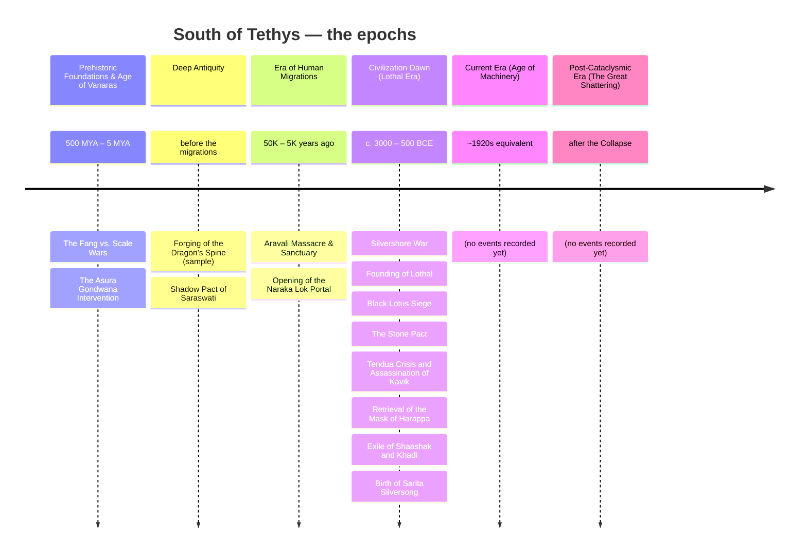

# The Timeline of South of Tethys

_Generated from `database/events/` and `database/timeline/epochs.json` by `utils/generate_timeline_mermaid.py`. Do not edit by hand._

## The epochs

## The events, by cause

Edges are `successors`. Events sit in the epoch they declare; an event with no edges is not adrift, it simply has no recorded cause or consequence yet.

```mermaid
graph TD
    subgraph epoch_prehistoric["Prehistoric Foundations & Age of Vanaras"]
        E0["The Fang vs. Scale Wars"]
        E1["The Asura Gondwana Intervention"]
    end
    subgraph epoch_deep_antiquity["Deep Antiquity"]
        E2["Forging of the Dragon’s Spine (sample)"]
        E3["Shadow Pact of Saraswati"]
    end
    subgraph epoch_migrations["Era of Human Migrations"]
        E4["Aravali Massacre & Sanctuary"]
        E5["Opening of the Naraka Lok Portal"]
    end
    subgraph epoch_civilization_dawn["Civilization Dawn (Lothal Era)"]
        E6["Silvershore War"]
        E7["Founding of Lothal"]
        E8["Black Lotus Siege"]
        E9["The Stone Pact"]
        E10["Tendua Crisis and Assassination of Kavik"]
        E11["Retrieval of the Mask of Harappa"]
        E12["Exile of Shaashak and Khadi"]
        E13["Birth of Sarita Silversong"]
    end
    E0 --> E1
    E6 --> E8
    E6 --> E7
    E7 --> E9
    E7 --> E8
    E8 --> E9
    E9 --> E10
    E10 --> E11
    E10 --> E12
    E11 --> E12
    E12 --> E13
```

## Epochs with no events yet

- **Current Era (Age of Machinery)** — ~1920s equivalent
- **Post-Cataclysmic Era (The Great Shattering)** — after the Collapse
