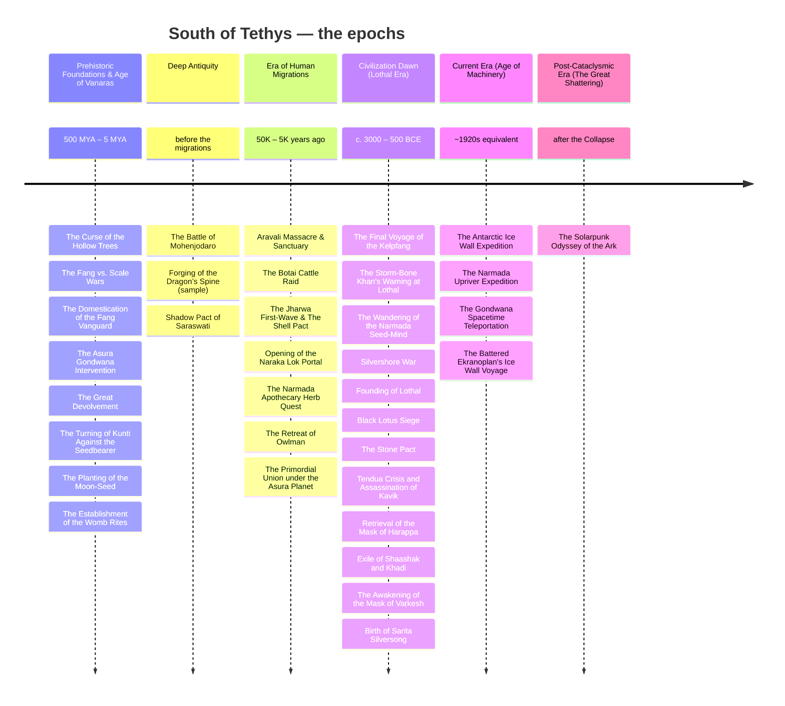
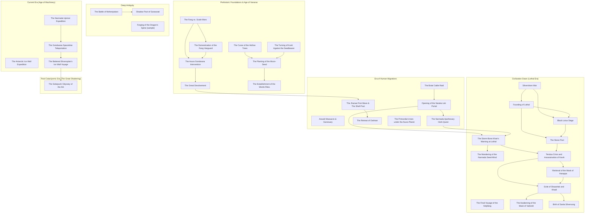

# The Timeline of South of Tethys

<a href="https://lordlebu.github.io/SouthOfTethys/">The Timeline</a> &middot; <strong>Epochs &amp; Events</strong> &middot; <a href="https://lordlebu.github.io/SouthOfTethys/atlas.html">The Atlas</a> &middot; <a href="https://lordlebu.github.io/SouthOfTethys/memory_map.html">The Memory Map</a>

_Generated from `database/events/` and `database/timeline/epochs.json` by `utils/generate_timeline_mermaid.py`. Do not edit by hand._

## The epochs

## The events, by cause

Edges are `successors`. Events sit in the epoch they declare; an event with no edges is not adrift, it simply has no recorded cause or consequence yet.

